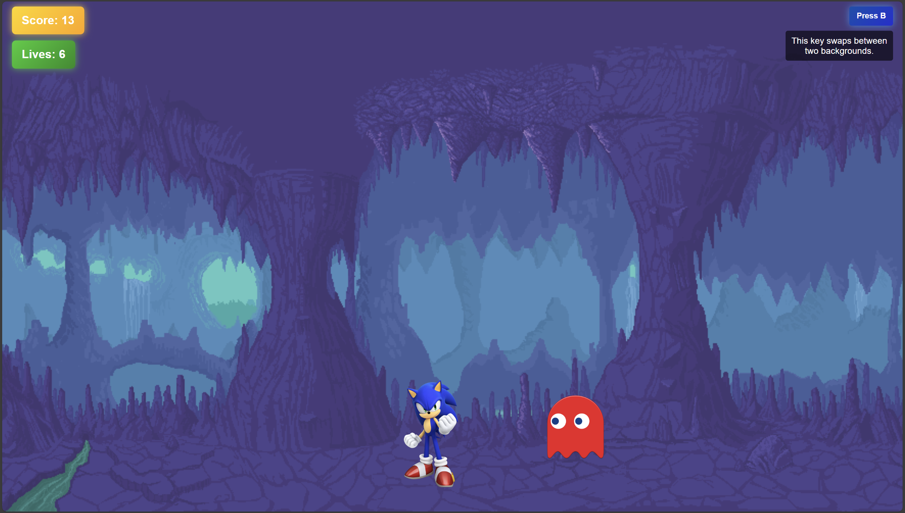
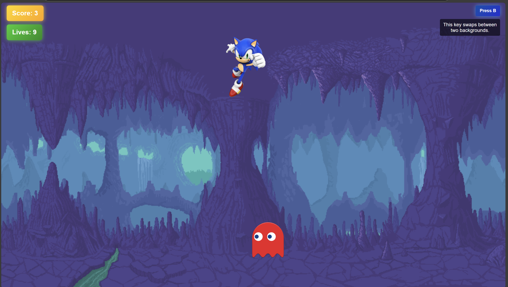

# WebDev101 Labs 🌐  

This repository contains **lab exercises** for the **WebDev101** course. Each lab builds foundational concepts for **HTML, CSS, JavaScript, DOM manipulation, forms, animations, web frameworks, and API development**.  

---  

## 📌 Lab 1: HTML & CSS Basics  

📄 **Course Reference:** [Course1 - HTML & CSS Basics](docs/course1.pdf)  

In this lab, I learned the **fundamentals of web development** using HTML and CSS:  

- **HTML Structure & Tags** (`
`, ``, `
`, `<h1>` etc.)  
- Using **class and id attributes** for styling  
- Embedding **images** and creating **div containers**  
- **CSS Basics**: selectors, colors, text styling  
- **Box Model**: `margin`, `padding`, `border`  
- **Linking CSS to HTML**  

---  

## 🔄 Lab 2: CSS Advanced & Layouts  

📄 **Course Reference:** [Course2 - CSS & Layouts](docs/course2.pdf)  

This lab introduced **CSS positioning techniques** and **layouts**:  

- **CSS Units**: `px`, `%`, `em`, `vh`, `vw`  
- **CSS Positioning**: `relative`, `absolute`, `fixed`, `sticky`  
- **Flexbox & Grid** for responsive layouts  
- **CSS Animations & Transitions** (`@keyframes`, `transform`, `transition`)  

---  

## 🏗️ Lab 3: JavaScript Basics & DOM Manipulation  

📄 **Course Reference:** [Course3 - JavaScript Basics](docs/course3.pdf)  

This lab covered **JavaScript programming** and **DOM manipulation**:  

- **JavaScript Variables** (`var`, `let`, `const`)  
- **Functions and Event Listeners** (`addEventListener`)  
- **DOM Selection & Manipulation** (`getElementById`, `querySelector`)  
- **Modifying HTML & CSS using JavaScript**  
- **Handling User Events** (clicks, form inputs, etc.)  

---  

## 🎛️ Lab 4: Forms & Input Handling  

📄 **Course Reference:** [Course4 - Forms & User Input](docs/course4.pdf)  

This lab focused on handling **user input and forms** in web applications:  

- **Creating HTML Forms** (`<input>`, `<textarea>`, `<select>`, `<button>`)  
- **Form Validation** using JavaScript  
- **Handling Input Events** (`onchange`, `onsubmit`)  
- **Pseudoclasses for Forms** (`:focus`, `:hover`, `:checked`)  

---  

## ⚡ Lab 5: JavaScript Timers & Asynchronous Code  

📄 **Course Reference:** [Course5 - JavaScript Timers & Events](docs/course5.pdf)  

This lab introduced **asynchronous JavaScript** and **timers**:  

- **setTimeout & setInterval** (`setInterval(func, 1000)`)  
- **Creating dynamic elements** (`document.createElement`, `appendChild`)  
- **Event Loop & Asynchronous Execution**  
- **Handling multiple user interactions asynchronously**  

---  

## 🎮 Midterm Project: Sonic Jump Game  

As part of the **midterm project**, I developed a **2D platformer game** featuring **Sonic the Hedgehog** 🦔. The game mechanics include **jumping over obstacles**, **dodging phantoms**, and **background switching** to enhance visual appeal.  

### 🕹️ How to Play  

- **Press SPACE** to make Sonic **jump**.  
- **Avoid phantoms**—colliding with them reduces your lives!  
- **Press "B"** to **change the background dynamically**.  
- **Survive as long as possible** to achieve a high score.  

### 📸 Screenshots  

| **Initial Background** | **Jumping Animation** | **Background Change** |
|------------------------|----------------------|-----------------------|
|  |  |  |

---  

## 🚀 Extra: Git & Web Development Workflow  

📄 **Course Reference:** [Git Cheat Sheet](docs/git_cheat_sheet.pdf)  

A separate **Git workshop** covered **version control** for web development:  

- **Git vs. GitHub** – Managing repositories  
- **Cloning, committing, pushing, and pulling**  
- **Branching & Merging for collaborative projects**  
- **Using GitHub Classroom for lab submissions**  

---  

## 📂 Documentation  

All course slides and notes are available in the **docs/** directory.  
📌 The courses are in **Romanian** 🇷🇴.  
